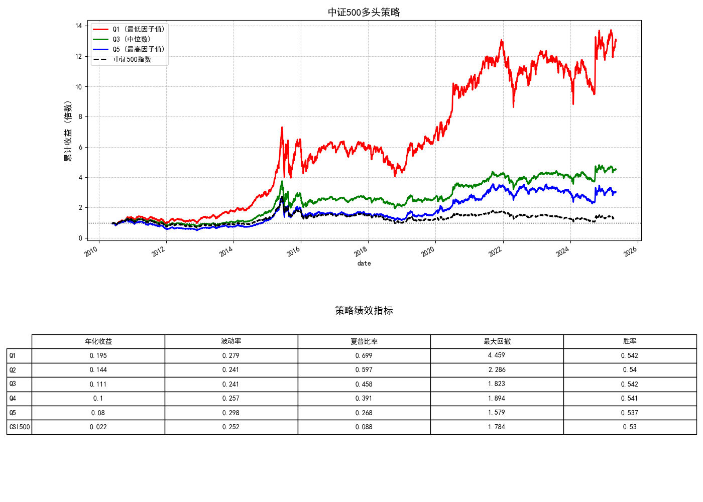

# MFE5210-Assignment

## 因子1&2：A股动量/反转因子因子构造与回测

我们复现了2020年开源证券《A股市场中如何构造动量因子？》（见reference文件夹）的量化策略，通过振幅切割涨跌幅因子，构造具有显著动量效应的因子，并提供完整的回测与可视化分析。

## 因子意义

### 背景

- **传统涨跌幅因子**在A股普遍呈现**反转效应**（过去收益高的股票未来表现差）。
- 本策略从**交易行为维度**出发，通过**日度振幅切割**，分离出具有**动量效应**的因子。

### 因子定义

- **A因子（动量因子）**：选取窗口期（N）内**低振幅交易日**的涨跌幅加总，捕捉稳定趋势。
- **B因子（反转因子）**：选取窗口期（N）内**高振幅交易日**的涨跌幅加总，捕捉过度反应后的反转。

## 实现方式

### 核心逻辑

1. **数据预处理**  
   
   - 按股票代码和日期排序，计算日收益率和振幅。
   - 根据IC值确定最优超参数N和λ
   - 使用滑动窗口（最优超参数`N=160`）遍历历史数据。

2. **振幅切割**  
   
   - **A因子**：取窗口内振幅最低的`λ=70%`交易日，计算其收益加总。
   - **B因子**：取窗口内振幅最高的`1-λ=30%`交易日，计算其收益加总。

3. **因子计算**  
   
   - 向量化加速：利用`numpy.lib.stride_tricks.sliding_window_view`高效处理滑动窗口。
   - 代码函数：  
     - `calculate_A_factor_vectorized()`：计算动量因子。  
     - `calculate_B_factor_vectorized()`：计算反转因子。

## 因子3：STR凸显效应因子构造

### 背景

近年来，凸显理论（Salience Theory）亦是行为金融学领域中对资产定价具有重要影响的一个热门研究方向。

BGS（2012）认为在资产的横向比较中，投资者的注意力往往会被吸引到平均而言最具有凸显性的回报上，而不凸显的回报往往会被忽略。例如，我们可能只会记得某只股票当月发生过涨停，而不记得它微涨 2%的时候。因此，投资者对于不同的收益大小会存在不同的心理权重，将这种心理偏好以定量的形式进行表达，能够帮助更加精细化地描绘资产价格相对于其真实价值的偏离程度。Cosemans 等（2021）基于凸显理论构建了 ST 指标，将投资者的投资决策心理进行了还原。当 ST 为正时，股票的最高回报较为突出，导致投资者过度关注股票的上涨潜力，从而成为风险寻求者；当投资者过分关注股票的负收益并强调其下行风险时，ST 为负，相关的股票将面临过度低估。

将前景理论与凸显理论进行对比可以发现：在前景理论中，投资者进行投资决策的心理权重偏差在于给予了和尾部收益相关的小概率事件更高的权重；而在凸显理论中，极端收益被加权的原因并不是因为它们的发生概率小，而是因为它们在截面上相对市场平均收益来说具有凸显性，凸显理论模型认为资产的溢价不是由投资者的偏好驱动的，而是由资产收益相对市场平均收益脱颖而出的程度驱动的，当中既包含了时序信息，也包含了截面信息。我们复现了2022年招商证券研报《行为金融新视角，“凸显性收益”因子STR》中的STR因子构造方法。

### STR因子构造
**Step1:**  
计算股票 $i$ 在第 $d$ 天的收益与市场平均收益的距离：

$$
\sigma\_{i,d} = \frac{|r\_{i,d} - \bar{r}\_d|}{|r\_{i,d}| + |\bar{r}\_d| + \theta}
$$

其中 $\theta=0.1$ 用于防止分母为零。

---

**Step2:**  
对过去一个月每日的 $\delta(r\_{i,d})$ 排序，得到 $k\_{i,d}$，并计算凸显权重：

$$
\omega\_{i,d} = \frac{\delta^{k\_{i,d}}}{S}
$$

归一化因子 $S$ 为：

$$
S = \sum\_{d^{\prime}} \delta^{k\_{i,d}} \pi\_{d^{\prime}}
$$

参数说明：
- $\delta=0.7$（控制权重扭曲程度）
- $\pi=1/N$（等权重概率）

---

**Step3:**  
当月 STR 值为收益与权重的协方差：

$$
\text{STR} = \text{cov}(\omega\_{i,d}, r\_{i,d})
$$

## 回测结果

### 回测数据：
- 中证500股票池，日频数据，2010年5月-2025年5月，剔除ST，上市不足160日的股票，使用akshare获取

### 回测结果
#### 因子1：动量因子回测结果：

#### 因子2：反转因子回测结果：

#### 因子3：STR因子回测结果：

#### 因子夏普率
- 见上述回测结果图中表格

#### 因子相关性

